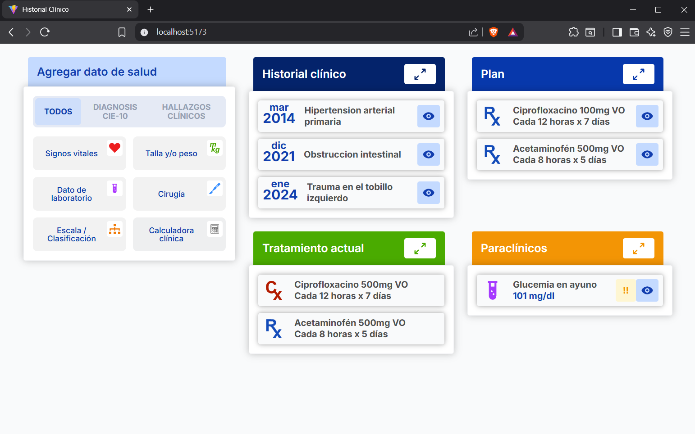

# React + TypeScript + Vite - Proyecto de Componentes Clínicos

Este proyecto proporciona una configuración completa para desarrollar componentes de interfaz de usuario para aplicaciones médicas, con un enfoque en la visualización de datos clínicos y resúmenes de pacientes.

## 📸 Demo Visual



_Interfaz de usuario implementada con widgets médicos y componentes de resumen clínico_

### 📝 Nota sobre la Implementación Visual

La implementación visual se realizó basándose en la imagen de referencia `preview/screenshot.png`. Se hizo el mayor esfuerzo por replicar fielmente los componentes, UI, estilos, texto e iconos de la propuesta original.

**Desafío de Implementación:**

- Se trabajó con una imagen plana como referencia, lo cual dificulta la extracción precisa de detalles como colores exactos, tipografía, márgenes, padding, sombras y bordes
- En un ambiente de trabajo real, normalmente se tendría acceso al diseño editable en herramientas como **Figma**, donde se pueden inspeccionar todos los detalles del diseño de manera precisa
- A pesar de estas limitaciones, se logró una implementación visual muy cercana a la propuesta original

**Componentes Implementados:**

- Widgets de resumen clínico con estructura y estilos similares
- Sistema de pestañas funcional en "Agregar dato de salud"
- Iconografía y elementos visuales replicados
- Paleta de colores adaptada para la aplicación médica

## 🚀 Configuración Inicial del Proyecto

### 1. Creación del Proyecto Base

```bash
npm create vite@latest frontend-test-history-01 -- --template react-ts
cd frontend-test-history-01
npm install
```

### 2. Dependencias Principales Instaladas

#### Dependencias de Producción:

- **React 19.1.0** - Biblioteca principal para la interfaz de usuario
- **React DOM 19.1.0** - Renderizado de React en el navegador
- **@tanstack/react-query 5.81.5** - Gestión de estado del servidor y caché
- **Zustand 5.0.6** - Gestión de estado global ligero y eficiente

#### Dependencias de Desarrollo:

- **TypeScript 5.8.3** - Tipado estático para JavaScript
- **Vite 7.0.0** - Herramienta de construcción y servidor de desarrollo
- **@vitejs/plugin-react 4.5.2** - Plugin de React para Vite
- **vite-plugin-svgr 4.3.0** - Soporte para importar SVGs como componentes React

### 3. Configuración de Tailwind CSS

#### Instalación:

```bash
npm install -D tailwindcss@4.1.11 @tailwindcss/postcss@4.1.11 autoprefixer@10.4.21 postcss@8.5.6
```

#### Configuración:

- **tailwind.config.js** - Configuración personalizada con colores específicos para la aplicación médica
- **postcss.config.js** - Configuración de PostCSS para Tailwind
- **src/index.css** - Estilos base de Tailwind importados

#### Características Configuradas:

- Fuente Inter como fuente principal
- Paleta de colores personalizada para componentes médicos
- Configuración de contenido para archivos HTML, JS, TS, JSX, TSX

### 4. Configuración de ESLint

#### Instalación:

```bash
npm install -D eslint@9.29.0 @eslint/js@9.29.0 typescript-eslint@8.34.1 eslint-plugin-react-hooks@5.2.0 eslint-plugin-react-refresh@0.4.20 globals@16.2.0
```

#### Configuración:

- **eslint.config.js** - Configuración moderna de ESLint con TypeScript
- Reglas específicas para React Hooks y React Refresh
- Soporte completo para TypeScript

### 5. Configuración de Zustand

#### Instalación:

```bash
npm install zustand@5.0.6
```

#### Configuración:

- **src/lib/store.ts** - Store global de Zustand para gestión de estado de UI
- Configuración con DevTools para desarrollo
- Estado centralizado para snackbar y tabs de salud

#### Características Implementadas:

- **Gestión de Snackbar**: Estado global para notificaciones
- **Gestión de Tabs**: Estado para pestañas de "Agregar dato de salud"
- **Selectores Optimizados**: Evita re-renders innecesarios

#### Estructura del Store:

```typescript
interface UIState {
  snackbar: {
    isVisible: boolean;
    message: string;
    type: SnackbarType;
  };
  healthDataTab: HealthDataTab;
  showSnackbar: (message: string, type?: SnackbarType) => void;
  hideSnackbar: () => void;
  setHealthDataTab: (tab: HealthDataTab) => void;
}
```

#### Beneficios de la Implementación:

- **Performance**: Reducción significativa de re-renders innecesarios
- **Mantenibilidad**: Estado centralizado y predecible
- **Simplicidad**: API simple y fácil de usar
- **TypeScript**: Soporte completo de tipos
- **DevTools**: Herramientas de debugging integradas

### 6. Configuración de Testing

#### Instalación:

```bash
npm install -D vitest@2.1.8 @vitest/ui@2.1.8 jsdom@24.0.0 @testing-library/react@16.1.0 @testing-library/jest-dom@6.6.3 @testing-library/user-event@14.5.2
```

#### Configuración:

- **vite.config.ts** - Configuración de Vitest con jsdom
- **src/test/setup.ts** - Configuración de pruebas
- Testing Library para pruebas de componentes React

### 6. Configuración de TypeScript

#### Archivos de Configuración:

- **tsconfig.json** - Configuración principal de TypeScript
- **tsconfig.app.json** - Configuración específica para la aplicación
- **tsconfig.node.json** - Configuración para herramientas de Node.js

### 7. Configuración de Vite

#### Características Configuradas:

- Plugin de React para Fast Refresh
- Plugin SVGR para importar SVGs como componentes
- Alias de rutas para mejor organización del código:
  - `@` → `./src`
  - `@components` → `./src/components`
  - `@features` → `./src/features`
  - `@assets` → `./src/assets`
  - `@types` → `./src/types`
  - `@data` → `./src/data`
  - `@hooks` → `./src/hooks`

### 8. Estructura del Proyecto

```
src/
├── components/     # Componentes reutilizables
├── features/       # Características específicas de la aplicación
├── hooks/          # Custom hooks de React
├── utils/          # Utilidades y funciones auxiliares
├── types/          # Definiciones de tipos TypeScript
├── data/           # Datos estáticos y mocks
├── assets/         # Imágenes, iconos y otros recursos
├── lib/            # Librerías y configuraciones
└── test/           # Configuración de pruebas
```

## 🎯 Propósito del Proyecto

Este proyecto está diseñado para implementar componentes de interfaz de usuario para aplicaciones médicas, específicamente:

- **Widgets de Resumen Clínico** - Componentes para mostrar información del paciente
- **Gestión de Datos de Salud** - Interfaz para agregar y visualizar datos médicos
- **Historial Clínico** - Visualización de antecedentes médicos
- **Tratamiento Actual** - Seguimiento de medicamentos y tratamientos
- **Paraclínicos** - Resultados de exámenes de laboratorio
- **Gestión de Estado Global** - Estado centralizado con Zustand para UI y React Query para datos del servidor

## 🛠️ Scripts Disponibles

```bash
npm run dev          # Inicia el servidor de desarrollo
npm run build        # Construye la aplicación para producción
npm run preview      # Previsualiza la build de producción
npm run lint         # Ejecuta ESLint para verificar el código
npm run test         # Ejecuta las pruebas con Vitest
npm run test:ui      # Ejecuta las pruebas con interfaz gráfica
npm run test:run     # Ejecuta las pruebas una vez
```

## 📋 Criterios de Aceptación Implementados

El proyecto incluye la implementación de los siguientes criterios de aceptación:

1. **AC1**: Despliegue general de widgets (5 componentes principales)
2. **AC2**: Estructura de pestañas en "Agregar dato de salud"
3. **AC3**: Comportamiento de la pestaña "TODOS" por defecto
4. **AC4**: Comportamiento de las pestañas de filtro
5. **AC5**: Estructura común de widgets de datos
6. **AC6**: Formato de ítem en "Historial clínico"
7. **AC7**: Formato de ítem en "Tratamiento actual" y "Plan"
8. **AC8**: Formato de ítem en "Paraclínicos"
9. **AC9**: Renderizado de contenido dinámico

---

## 👨‍💻 Desarrollador

**Sergio Rivera**  
_Frontend Developer_
_Panama_

- **GitHub:** [@riveraser](https://github.com/riveraser)
- **LinkedIn:** [Sergio Rivera](https://linkedin.com/in/sergio-rivera-morales)
- **Email:** sergi.erm@gmail.com

### 🛠️ Tecnologías Utilizadas en este Proyecto

- React 19 + TypeScript
- Vite + Tailwind CSS
- ESLint + Testing Library
- Zustand + React Query

---

_Proyecto desarrollado como parte de prueba en React para Startup._
